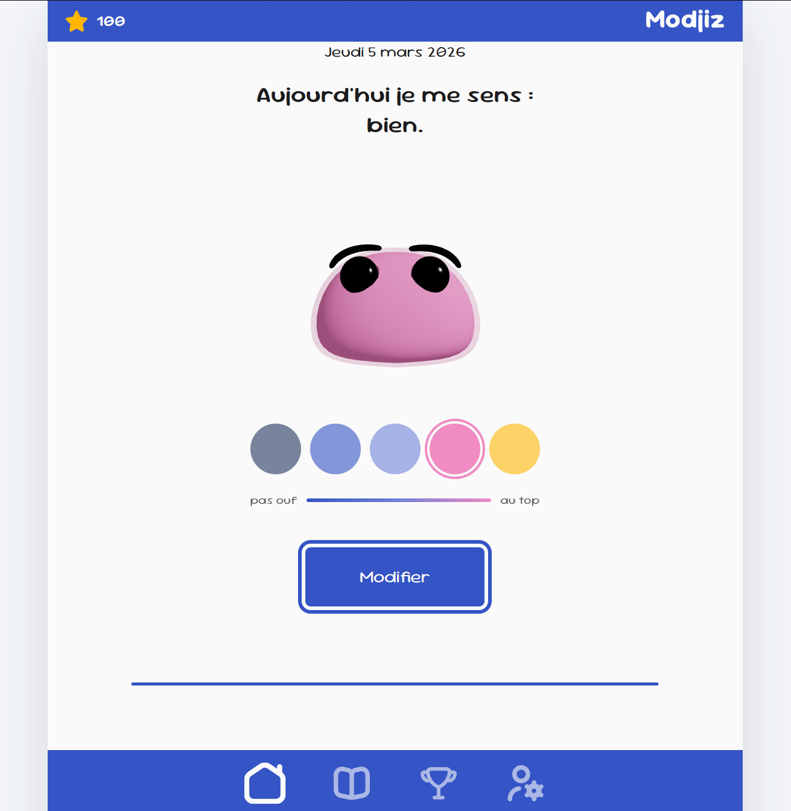

# Modjiz

Application de suivi d’humeur développée avec Next.js permettant d’analyser ses émotions dans le temps à travers des statistiques, de la visualisation et de la gamification.

## 🚀 Aperçu

## 📌 Fonctionnalités

- 😊 enregistrement de l’émotion quotidienne
- 🎭 mascotte 3D dynamique représentant l’humeur
- 📊 tableau de statistiques mensuelles et annuelles
- 📈 moyennes, tendances et comparaisons
- 🏆 système de gamification (trophées)
- ⚡ mise à jour instantanée des données
- 🧪 données simulées via sessionStorage (version mockée)

## 🛠️ Technologies utilisées

### Frontend

- React
- Next.js
- Three.js

### Stockage temporaire

- sessionStorage (mock de persistance)

## ⚙️ Fonctionnement

- l’utilisateur enregistre son humeur du jour
- une mascotte 3D reflète visuellement l’émotion
- les données sont stockées temporairement (sessionStorage)
- l’application calcule des statistiques (mensuelles / annuelles)
- une page dédiée permet de visualiser les tendances et comparaisons
- des trophées sont débloqués selon l’activité utilisateur

## 🧱 Architecture

- architecture basée sur Next.js pour anticiper une évolution fullstack
- séparation des composants UI / logique métier
- gestion d’état côté client
- logique de simulation des données (mock)
- structure pensée pour intégrer une API sans refactor majeur

## 🎯 Objectifs du projet

Ce projet m’a permis de :

- concevoir une application centrée utilisateur (UX + émotion)
- manipuler et analyser des données temporelles
- implémenter des logiques de gamification
- préparer une architecture évolutive (frontend → fullstack → mobile)

## 🎯 Ce que j’ai appris

- gestion d’état et rendu dynamique avec React / Next.js
- manipulation de données statistiques
- conception d’une UX engageante
- intégration de logique de gamification
- structuration d’un projet évolutif
- simulation d’un backend avec sessionStorage

## 🚧 Roadmap

### 🔹 V1 — Version actuelle

- frontend fonctionnel
- données mockées (sessionStorage)
- stats + gamification

### 🔹 V2 — Backend & comptes utilisateurs

- API (Next.js ou Node.js)
- authentification (login / signup)
- base de données (persistance réelle)
- synchronisation multi-device

### 🔹 V3 — Application mobile

- développement en React Native
- synchronisation avec le backend
- amélioration UX mobile

## 👨‍💻 Auteur

CHARVOT Marc
GitHub : https://github.com/PYXHD
